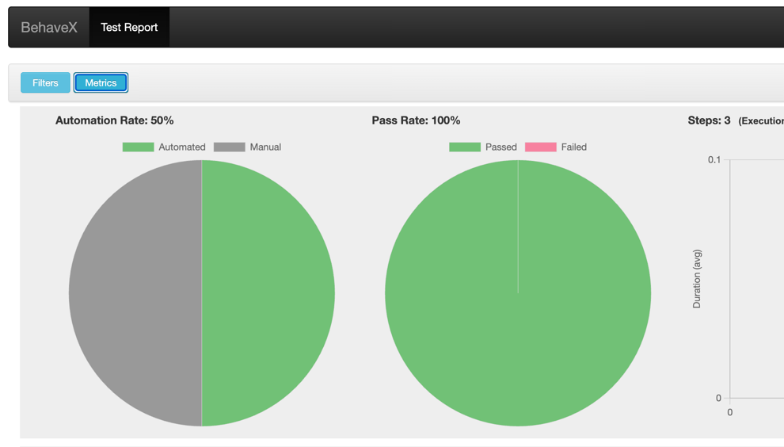

This is a sample skeleton framework using beahve x playwright..
This framework enables you to do parallel execution

Open this project in your pycharm or any IDE
```
pip3 install -r requirements.txt
```

Execute the below command in terminal

```
behavex
```
If you want to execute some specific tags
```
behavex -t "tag_name"
```

For parallel execution 
```
behavex -t "tag_name" --parallel-processes 2
```
After executing the tests, a new output folder will be generated. You can see the report in `output/report.html`

**NOTE:** For testing purpose I added facebook.com as URL. So, please change your Test URL 😜
